# 🎬 Animated README Concept - Validation Test

> **Expérimentation : README.md entièrement animé via SVG**  
> Ce repo valide le concept de "SVG-Driven README" avec 3 approches différentes.

---

## 🎯 Objectif de l'Expérimentation

Prouver qu'on peut créer des **README.md cinématiques** avec :
- ✅ Animations séquentielles multi-scènes
- ✅ Storytelling visuel complet
- ✅ Taille optimale (1200x800px) pour visibilité mobile
- ✅ Compatibilité GitHub (sans JavaScript)

---

## 🎨 VERSION A : "CINEMATIC" (60 secondes)

**Concept :** Film complet avec 7 scènes narratives


### Timeline Complète :
```
0-8s   : Logo drop avec bounce (comme lunettes)
8-15s  : Titre + tagline + version badge
15-25s : Le Problème (icônes fragmentées)
25-35s : La Solution (hub connecté)
35-45s : Features grid + statistiques
45-55s : Team/Founder card
55-60s : CTA + boucle infinie
```

**Idéal pour :** Projets complexes nécessitant explication détaillée

---

## ⚡ VERSION B : "EXPRESS" (30 secondes)

**Concept :** Version rapide, essentiel uniquement


### Timeline Simplifiée :
```
0-8s   : Brand intro (logo + nom)
8-16s  : Value proposition (3 features)
16-23s : How it works (3 steps)
23-30s : CTA + boucle
```

**Idéal pour :** Outils simples, libraries, CLI tools

---

## 🎨 VERSION C : "HERO" (Poster permanent)

**Concept :** Une seule scène "poster" avec animations subtiles continues



### Éléments Clés :
- Logo central avec orbites
- Titre + tagline
- 3 features en grille
- Stats bar (utilisateurs, déploiements, uptime)
- Pulse rings continus
- Shine effect périodique

**Idéal pour :** Produits établis, marque forte, impact visuel maximal

---

## 📊 Comparaison des Approches

| Critère | Cinematic (60s) | Express (30s) | Hero (Poster) |
|---------|----------------|---------------|---------------|
| **Durée** | 60 secondes | 30 secondes | Permanent |
| **Complexité** | Haute | Moyenne | Faible |
| **Message** | Storytelling complet | Pitch rapide | Impact immédiat |
| **Engagement** | Maximum | Élevé | Continu |
| **Maintenance** | Moyenne | Faible | Très faible |
| **Use Case** | Projet complexe | Tool simple | Marque établie |

---

## 🚀 Avantages du Concept

### ✅ **Visibilité Maximale**
- Taille **1200x800px** (vs 100x100px logos standards)
- Texte **gros et lisible** sur mobile
- Animations captivantes = engagement

### ✅ **Storytelling Puissant**
- **Séquence narrative** complète
- Compréhension en **30-60 secondes**
- Mémorisation via animations

### ✅ **Différenciation Totale**
- **99% des README = texte statique**
- Expérience **cinématique unique**
- WOW factor garanti

### ✅ **Technique Viable**
- ✅ Pas de JavaScript requis
- ✅ Animations SVG natives
- ✅ Compatible GitHub/GitLab
- ✅ Cache navigateur efficace

---

## 🎯 Résultats Attendus

### Hypothèses à Valider :
1. ✅ Les animations multi-scènes fonctionnent sur GitHub
2. ✅ Le temps de chargement reste acceptable (<5s première fois)
3. ✅ La lisibilité mobile est excellente
4. ✅ L'engagement utilisateur est supérieur aux README standards
5. ✅ La maintenance reste simple (1 fichier SVG)

### Métriques à Observer :
- ⏱️ Temps de chargement initial
- 📱 Rendu sur mobile vs desktop
- 🔄 Performance du cache après 1ère visite
- 👁️ Réaction des visiteurs (stars, commentaires)

---

## 🔧 Instructions de Test

### Pour Reproduire :
```bash
# 1. Créer nouveau repo
git init animated-readme-test

# 2. Ajouter les 3 fichiers SVG
# - cinematic.svg (Version A)
# - express.svg (Version B)
# - hero.svg (Version C)

# 3. Copier ce README.md

# 4. Push et observer
git add .
git commit -m "Test: Animated README concept"
git push origin main

# 5. Attendre 5 min que GitHub cache les SVG
# 6. Vérifier sur mobile ET desktop
```

### Checklist de Validation :
- [ ] Version A (Cinematic) s'affiche correctement
- [ ] Version B (Express) s'affiche correctement
- [ ] Version C (Hero) s'affiche correctement
- [ ] Les animations fonctionnent sur mobile
- [ ] Les animations bouclent proprement
- [ ] Le texte est lisible à toutes les tailles
- [ ] Pas de lag/freeze pendant les animations
- [ ] Le cache fonctionne (rechargement rapide)

---

## 💡 Cas d'Usage Identifiés

### 🎬 **Cinematic** (60s)
- Plateformes SaaS complexes
- Outils DevOps avec multiples features
- Projets nécessitant éducation utilisateur
- Démonstrations de workflow

### ⚡ **Express** (30s)
- CLI tools
- Libraries/Frameworks
- APIs simples
- Outils single-purpose

### 🎨 **Hero** (Poster)
- Marques établies
- Produits mature (v2.0+)
- Focus sur l'impact visuel
- Communautés larges (50K+ users)

---

## 🌟 Évolutions Futures Possibles

### Si le Concept Fonctionne :
1. **Template Generator** : Outil pour créer son animated README
2. **GitHub Action** : Auto-update des stats dans le SVG
3. **Interactive Version** : Click zones avec `<a>` tags
4. **Multi-Language** : Switch langues dans l'animation
5. **Dark/Light Mode** : Détection `prefers-color-scheme`

### Limitations Identifiées :
- ⚠️ Taille fichier (50-150KB vs 5KB texte)
- ⚠️ Accessibilité screen readers (mitigé avec `<title>` et `<desc>`)
- ⚠️ SEO indexation (GitHub parse le SVG ?)
- ⚠️ Édition plus complexe que Markdown

---

## 📚 Références Techniques

### Standards Utilisés :
- **SVG 2.0** (W3C)
- **SMIL Animations** (Synchronised Multimedia Integration Language)
- **CSS Gradients** dans SVG
- **Easing functions** : `cubic-bezier(0.34, 1.56, 0.64, 1)` (overshoot)

### Ressources :
- [MDN SVG Animations](https://developer.mozilla.org/en-US/docs/Web/SVG/Element/animate)
- [SMIL Specification](https://www.w3.org/TR/SMIL/)
- [SVG Easing Functions](https://cubic-bezier.com/)

---

## 🎯 Conclusion Préliminaire

Ce concept ouvre une **nouvelle catégorie** de manipulation README.md sur GitHub :
- ✅ Techniquement viable
- ✅ Visuellement impactant
- ✅ Storytelling puissant
- ✅ Maintenance raisonnable

**Prochaine étape :** Valider en production réelle et observer les métriques d'engagement.

---

## 📧 Feedback

Si vous testez ce concept :
1. ⭐ Star le repo si ça marche
2. 💬 Ouvrir une issue avec vos observations
3. 🔀 Fork et créer votre version
4. 📊 Partager vos métriques d'engagement

---

**Status :** 🧪 Experimental  
**License :** MIT  
**Version :** 1.0.0-beta  
**Last Updated :** 2024-11-13

---

*Built with ❤️ using pure SVG animations and zero JavaScript*